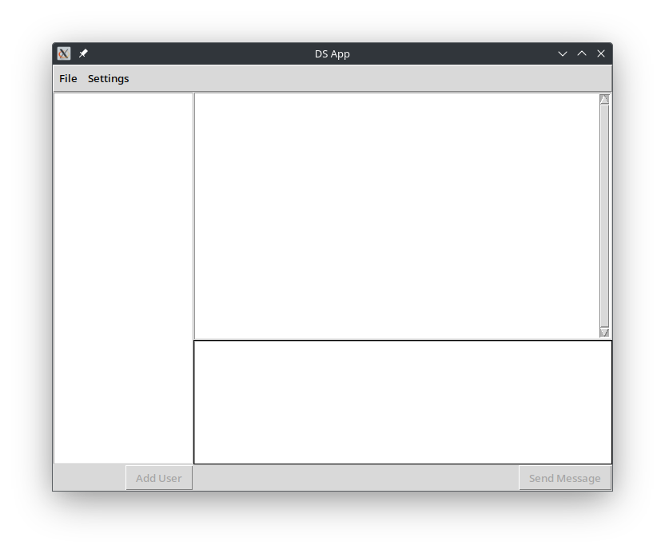

This is a simple text app built with networking libraries found in the
Python Standard Library and Tkinter that allows you to start a DM with
other people that are connected to the same server you are.

Before starting, make sure you have Tkinter installed.
To start using the program, run "python a5.py" in the Terminal.
You have to connect to a server in order to DM others. To do this,
click File, then click "New profile" if this is your first time, or
"Open profile" if you already have one on your computer.
Once a profile is open, you can start messaging.
